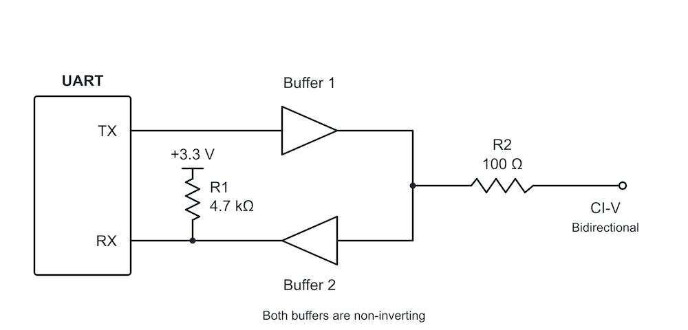
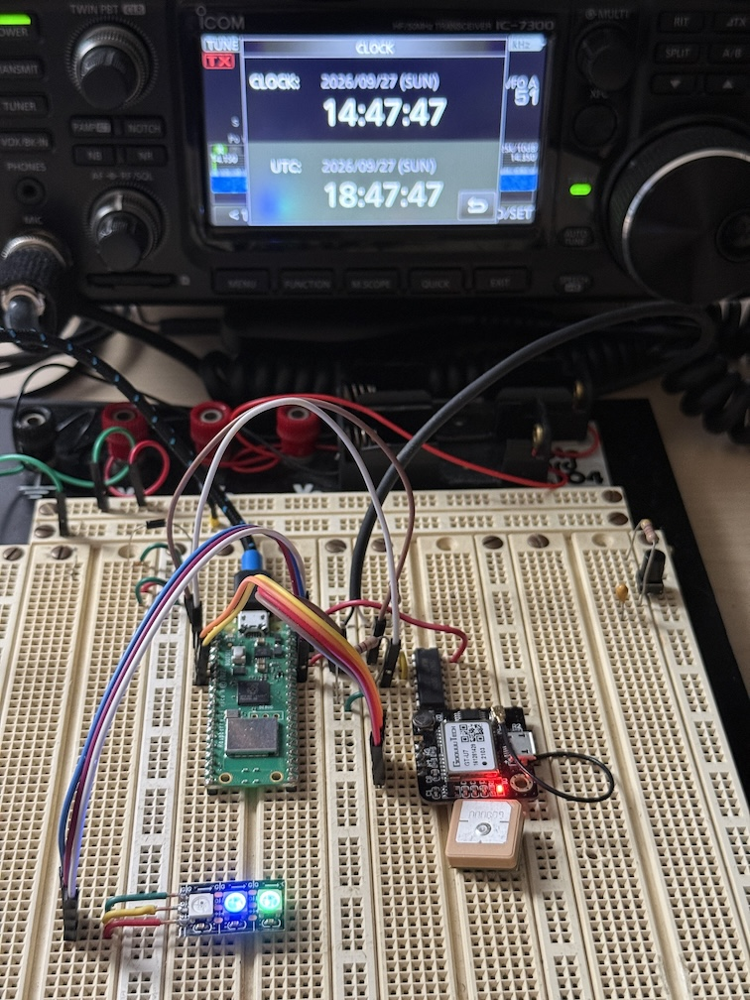

# civ7300 - IC-7300 CI-V interface to RP2040

RP2040 firmware that connects to an Icom IC-7300 over CI-V and synchronizes the radio clock from
GPS or NTP.

## Connections

Designed for a Raspberry Pi Pico-W RP2040 microcontroller, UART0 connects to/from the IC-7300
remote jack CI-V line via two open-collector buffers on a 7407 IC (see below).

The radio CI-V UART is configured for 19200 baud; the GPS UART is configured for 9600 baud. Both
use 8 data bits, no parity, and 1 stop bit (8N1).

| Connection | UART | TX GPIO | RX GPIO |
| --- | --- | ---: | ---: |
| Radio CI-V | UART0 | GP0 | GP1 |
| GPS receiver (Pico / Pico W / Waveshare RP2040 Zero) | UART1 | GP4 | GP5 |

Other CI-V controllers share the radio bus directly. The radio connection expects the external
CI-V interface/buffers to provide the required electrical interface and route the bus echo to
UART0 RX.

This project uses WS2812b LEDs to indicate status, but this could be eliminated or expanded
as desired.

## Radio Clock

The firmware includes IC-7300 CI-V support for reading and setting the date, time, and UTC offset.
Clock synchronization, frequency polling and CI-V traffic logging can be ebabled or disabled.
See the top level CMakeLists.txt file for compilation options, some values can be found in
civ7300.cpp and some options can be enabled/disabled dynamically (see in main.cpp).
When NTP is enabled on a Pico W, the firmware connects to Wi-Fi in station
mode. Once the wall clock is valid, it verifies the radio ID is an IC-7300 and checks the radio
clock every five minutes. Any date/time correction is applied at the next minute boundary because
the radio clock set command only has minute precision. The defaults in the root `CMakeLists.txt` are the
`America/New_York` time zone and automatic daylight-saving adjustment (`TIME_ZONE` and `USE_DST`);
change these for the deployment location.

When NTP synchronization is enabled for Pico W / Pico 2 W, Wi-Fi credentials are supplied by the
local, untracked `src/network_info.h`. Start with `network_info.h.example`, copy it to
`src/network_info.h`, and replace the placeholder SSID and password.

## Build and Flash

The project uses the Raspberry Pi Pico SDK 2.3.0 and the CMake workflow provided by the Raspberry
Pi Pico VS Code extension. The selected board is `pico_w` in the root `CMakeLists.txt`; change
`PICO_BOARD` there to build for another supported board. Build with the extension's configure/build
commands, then flash the generated `build/civ7300.uf2` (or use the extension's load/flash command).

## Source Layout

- `src/uart.*` - protocol-agnostic UART driver with DMA-buffered RX and blocking/nonblocking TX APIs.
- `src/radio_bridge.*` - queues CI-V transmissions, cancels bus echoes, and exposes genuine radio
  data to CI-V clients.
- `src/civ7300.*` - asynchronous IC-7300 CI-V commands and periodic clock synchronization.
- `src/timemgr.*` - wall-clock validity, NTP, time-zone/DST handling, and timestamped logging.
- `src/wifi_connection.*` - asynchronous Pico W station-mode connection and retry state machine.
- `src/led.*`, `src/button.*` - LED and button support.
- `src/main.cpp` - application startup, board pins, and main work loop.

## UART to CI-V schematic

Both buffers are non-inverting. R1 is 4.7 kΩ (4700 Ω); R2 is 100 Ω.

## Protoboard image

## 73 and have fun!
